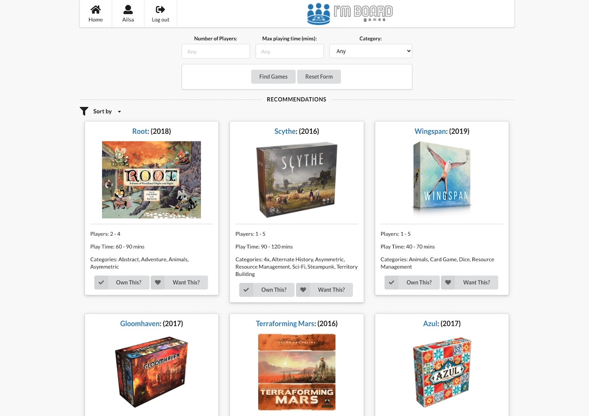

# I'm Board - Board Game Recommendation App

Built using Board Game Atlas API https://www.boardgameatlas.com/api/docs

## Project Brief

App that takes user info and recommends board games to play/purchase.

### MVP 

User can select:

* Number of players
* Preferred length of playing time 
* Categories they enjoy
* App returns  selection of board game suggestions to play that fit request  

### Extensions

* User can log in (user authentication)
  * User can mark games they already own and app won't suggest those
  * User can list games they liked, recommendations can use this information
* Affiliate links showing stock in different places
* Using Board Game Atlas API:
  * API has board game info and rankings
